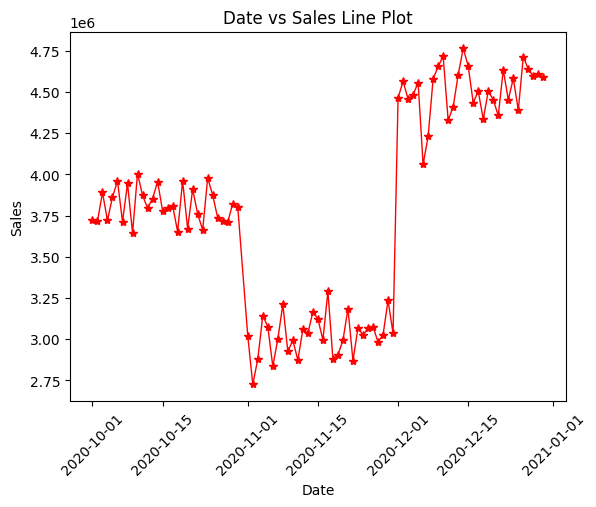
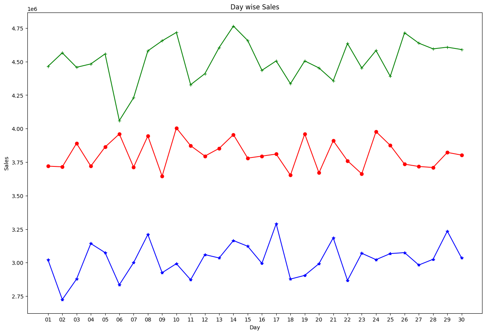
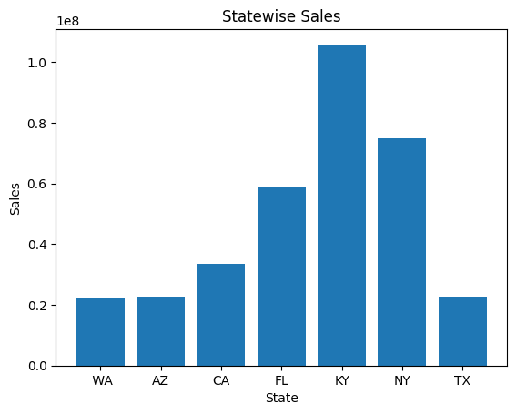

# Sales Data Analysis with Python

## Project Overview

This project focuses on analyzing sales data using Python in order to identify business trends, customer purchasing behavior, sales performance, and revenue patterns.

The analysis was performed using Python libraries for data manipulation, exploratory data analysis, and visualization techniques to transform raw sales data into actionable business insights.

---

# Business Objectives

- Analyze sales performance over time
- Identify sales trends across multiple months
- Explore customer purchasing behavior
- Detect patterns and outliers in sales distribution
- Compare monthly and statewise sales performance
- Support business decision-making through data analysis

---

# Tools Used

- Python
- pandas
- NumPy
- Matplotlib
- Seaborn
- Jupyter Notebook

---

# Key Analysis Areas

- Data Cleaning
- Data Normalization
- Exploratory Data Analysis (EDA)
- Monthly Sales Analysis
- Statewise Sales Analysis
- Sales Trend Analysis
- Distribution & Outlier Analysis
- Data Visualization

---

# Project Workflow

1. Import and inspect sales dataset
2. Handle and validate missing values
3. Normalize numerical variables
4. Perform exploratory data analysis
5. Analyze monthly and statewise trends
6. Create visualizations
7. Extract business insights

---

# Charts Preview

## Overall Sales Trend

Daily sales trend analysis highlighting overall business performance over time.



---

## Monthly Sales Comparison

Comparative monthly sales analysis across October, November, and December.



---

## Statewise Sales Analysis

State-level sales performance comparison used to identify geographic business trends.



---

# Repository Structure

```text
sales-data-analysis-python/
│
├── README.md
├── notebooks/
├── data/
├── charts/
└── documentation/
## Charts Preview

Screenshots and exported charts are available in the charts folder.

## Business Value

This project demonstrates how Python can be used to transform raw sales data into business insights that support better decision-making in sales, marketing, and operations.

## Author

David Maria Olandese
